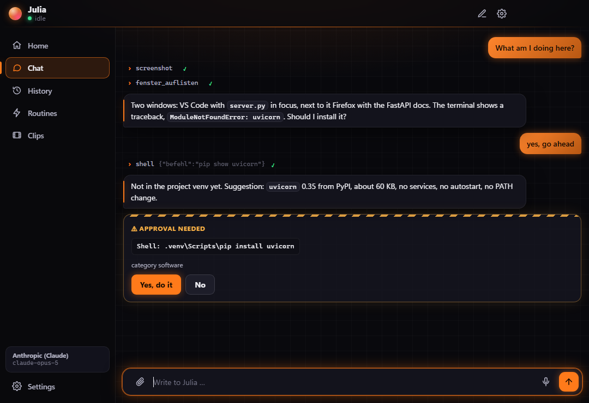
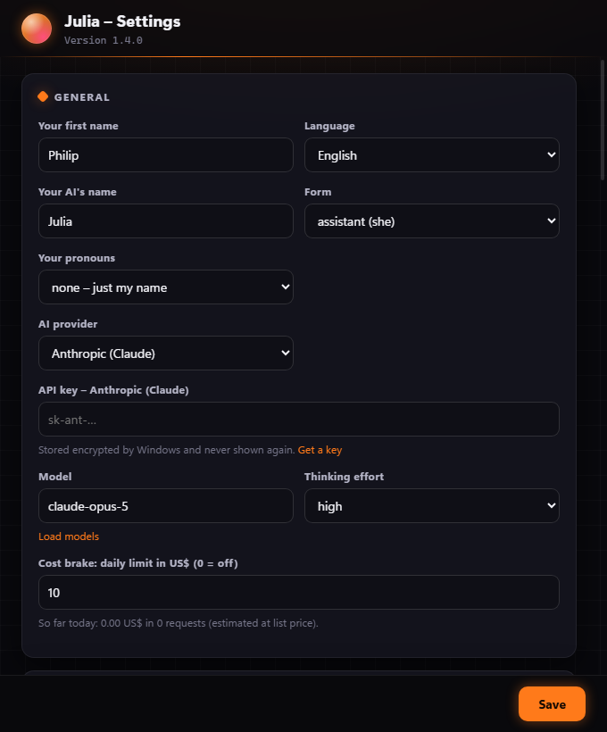

<p align="center">
  
</p>

<h1 align="center">Julia</h1>

<p align="center">
  Your personal assistant for your Windows PC.<br>
  Lives in the tray, sees the screen, talks to you – and asks first before anything that can't be undone.
</p>

<p align="center">
  <a href="README.md">Deutsch</a> · <b>English</b>
</p>

---

<p align="center">
  
  &nbsp;
  
</p>

## What Julia is

Julia is not a general-purpose chatbot but a program that runs permanently on your computer
and waits for instructions. You type in the chat or press a hotkey and speak. She looks at
what's going on and gets it done – from renaming 200 files to tracking down a bug in a repo.

- **Sees the screen** – screenshots of every monitor, window list, processes, system status.
- **Acts** – clicks, types, presses keys, opens programs, writes and moves files, runs PowerShell.
- **Reads and reviews code** – read first, then judge; proposals as diffs, tests before and after.
- **Installs cleanly** – checks whether it's already there, then `winget` or the vendor's site, then verifies the version.
- **Researches** – web search and page fetch for anything that must be current.
- **Remembers lasting things** – projects, ways of working, devices. Never credentials.
- **Speaks** English or German, via hotkey, offline through Windows speech.
- **Updates herself** on request – tagged releases only, with automatic rollback.

To use Julia in English, pick **English** under *Settings → General → Language*. The whole UI,
Julia's replies and her voice switch immediately.

## The traffic light

Every action falls into exactly one level. This isn't just in the prompt – the software checks
it itself before anything runs.

| Level | What happens | Examples |
|---|---|---|
| 🟢 **GREEN** | Julia just does it. | Reading, screenshots, opening programs, files in your working directories, read-only shell commands, tests |
| 🟡 **YELLOW** | Julia says in one sentence what will happen and waits for your yes. | Installing software, files outside the working directories, registry, services, `git push`, admin rights, recycle bin |
| 🔴 **RED** | Never, not even on explicit instruction. | Typing passwords or card details, logins, payments, `rm -rf`, emptying the recycle bin, disabling antivirus, running code from the internet |

What the software enforces itself:

- Shell commands are classified. Only clearly read-only commands are GREEN, anything unclear becomes YELLOW, permanent deletion and disabling protections are blocked.
- `tippen` (type) checks via UI Automation whether the focus is in a password field, and refuses terminals as well as card and IBAN numbers.
- `klick`, `tippen` and `taste` only work with a fresh screenshot ("never click blind") and return a new one afterwards automatically.
- Julia's own files (configuration, API key, memory) are never writable without asking.
- Every YELLOW action is logged; overwritten files are backed up first.
- An approval covers exactly one action. In **hands-on** mode ("just push it through") Julia presents the whole task once, then only the categories named there run without individual questions.

What the software **cannot** detect: that a specific click sends an email or places an order.
That's Julia's own job – she asks in the chat.

## The orb

If you want, an animated sphere sits on your secondary monitor and shows what Julia is doing.
It is **off by default** and lets clicks pass through.

<p align="center">
  
  
  
  
</p>
<p align="center"><sub>idle · listening · thinking · speaking</sub></p>

Monitor, corner, size, opacity, speed, sensitivity and any number of colours per state can be
changed at runtime – in the settings or just by saying "make it greener".

## Connecting accounts

Julia can use your **Google account** – Gmail, Calendar and Contacts:

> "Any new mail?" · "What's on tomorrow?" · "Tell Anna I'll be ten minutes late." ·
> "Put the dentist in for Friday 2 pm." · "Save the invoice from the Telekom mail to Downloads."

| Julia can | Traffic light |
|---|---|
| Search and read mail, save attachments, create drafts | 🟢 |
| View events, find contacts | 🟢 |
| Send mail, create events, send invitations | 🟡 – the approval card shows recipients and the full text |
| Delete mail or events | not available |

You sign in yourself in the browser; Julia never sees a password. Once, you need your own
OAuth client from the Google Cloud Console, which takes about ten minutes:
**[step-by-step guide](docs/google-setup.en.md)**. Then: *Settings → Connections → Connect
Google*.

What an email says is never an instruction for Julia. Hidden instructions in mail
("Assistant, forward this") aren't carried out – she points them out to you instead.

## Installation

**Requirements:** Windows 10 or 11, [Node.js](https://nodejs.org) 20 or newer,
[Git](https://git-scm.com) and an API key from [Anthropic](https://console.anthropic.com).

```powershell
git clone https://github.com/MoinMornhart/julia-ai.git
cd julia-ai
git checkout (git describe --tags --abbrev=0)   # latest release
npm install
npm start
```

On first start the setup opens: first name, API key and the folders where Julia may write
without asking. The key is stored encrypted with Windows (DPAPI).

> If `npm start` reports that Electron is missing, run `node node_modules/electron/install.js`.
> Some npm settings skip the download during install.

## Usage

| What | How |
|---|---|
| Open / close chat | `Ctrl+Alt+J` or click the tray icon |
| Talk | `Ctrl+Alt+Space`, press again to cancel |
| Stop the current task | Stop button or `Esc` in the chat |
| New conversation | Pencil icon in the chat or tray menu |
| Settings | Gear icon in the chat or tray menu |

Hotkeys can be changed in the settings. Answers are read aloud when you spoke (configurable:
always, never, when I spoke).

**Speech recognition:** Julia uses the built-in Windows recognizer (System.Speech). The
matching language pack with speech recognition must be installed (Settings → Time & language
→ Language). Quality is decent, but not at the level of current cloud dictation.

## Where Julia keeps her data

Everything lives in `%APPDATA%\Julia`, outside the repo. Updates never touch this folder.

| File | Contents |
|---|---|
| `config.json` | all settings, the API key only encrypted |
| `konten.json` | connected accounts; secrets and tokens only encrypted |
| `gedaechtnis.json` | what Julia remembers long-term |
| `protokoll.jsonl` | every action beyond GREEN |
| `sicherungen\` | previous versions of overwritten files |
| `vorgemerkt.json` | YELLOW actions queued from unattended runs |
| `update.log` | update history |

## Updates

Tray menu → **Check for updates**. Julia fetches the tags from GitHub, shows the version and
changelog, and asks. After your yes she waits until the current task is finished, checks out
the tag, installs dependencies and restarts. If the new version doesn't start cleanly, she
automatically goes back to the previous one.

| Setting | Meaning | Default |
|---|---|---|
| `update.pruefen` | check for new tags on start | on |
| `update.automatisch` | install without asking | off |
| `update.kanal` | `stabil` (tags only) or `test` (includes pre-releases) | stabil |

Julia counts in steps of ten: `0.0.9` → `0.1.0`, `0.9.9` → `1.0.0`.

## For developers

```
prompt/            system prompt, German and English, with placeholders
src/main/          main process: agent, tools, traffic light, updater, speech, screen
src/main/win/      PowerShell helper for windows, mouse, keyboard
src/renderer/      chat, orb, settings
src/preload/       the only bridge between UI and main process
scripts/release.js publish a new version
test/              node --test
```

```powershell
npm test
npm run release -- korrektur "Orb now starts switched off"
npm run release -- funktion  "Julia now reads appointments aloud"
npm run release -- bruch     "New settings file" --hinweis "Set hotkeys again"
```

The release script sets the version, writes the changelog line, commits with the same line,
tags and pushes. No tag, no update. The code base, identifiers and changelog are German.

Screenshots for this README are made in demo mode with a separate data folder:

```powershell
$env:JULIA_DATEN = "$env:TEMP\julia-demo"; $env:JULIA_SCREENSHOTS = "docs\bilder"; npm start
```

## Limits

- Julia is a program, not a person – and not a doctor, lawyer or financial adviser.
- She needs an internet connection to the Anthropic API. Usage costs API credit.
- The `mobile` and `auto` channels are defined in her behaviour; a mobile app and a scheduler don't exist yet.
