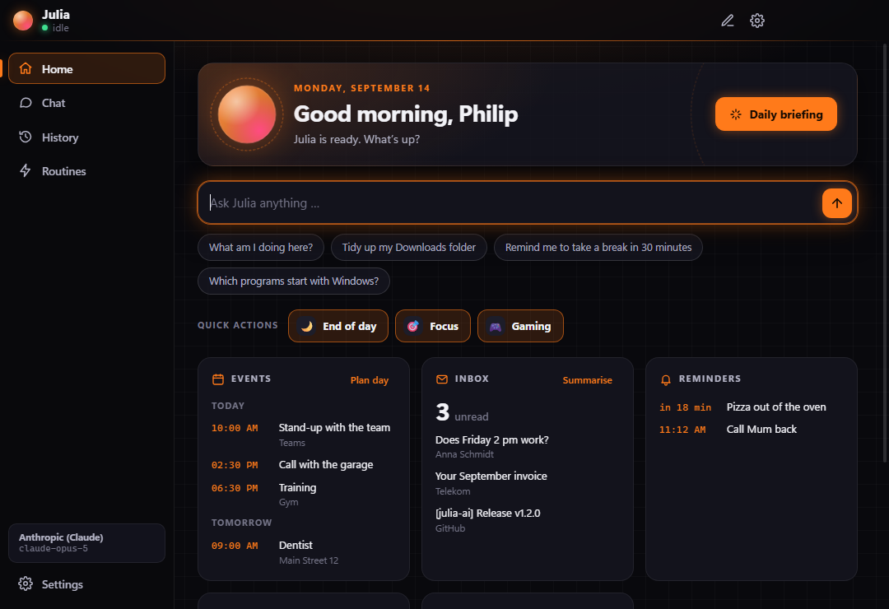
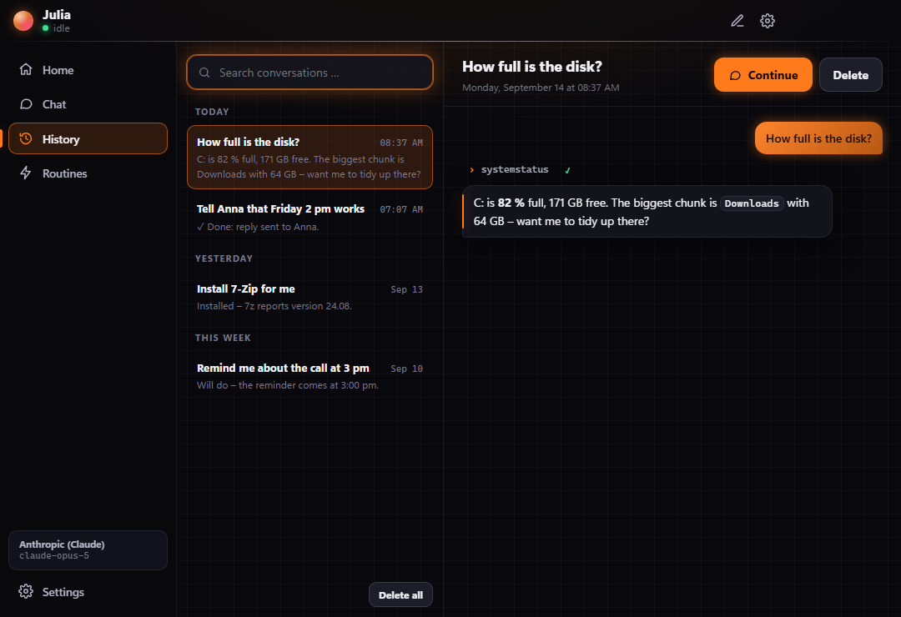
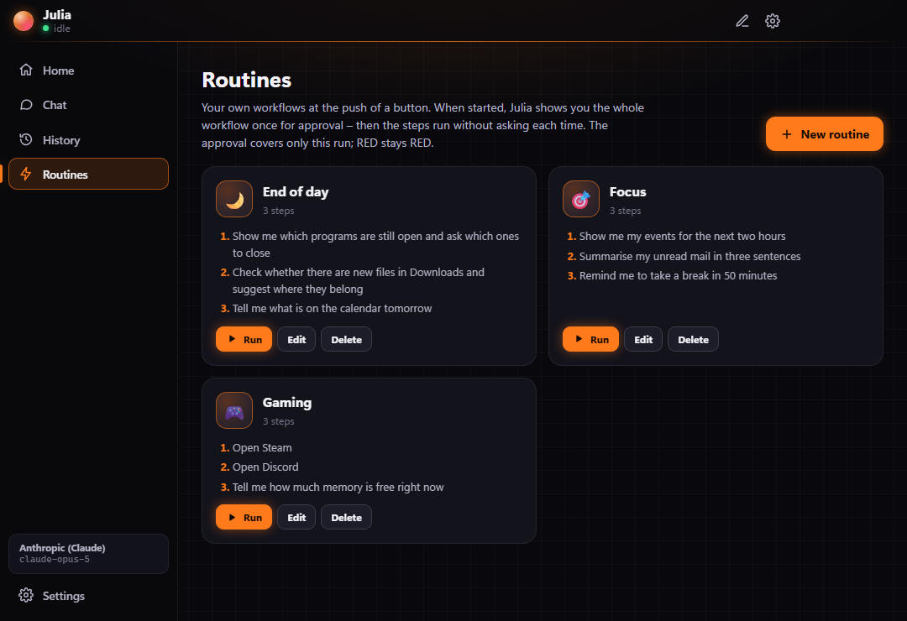
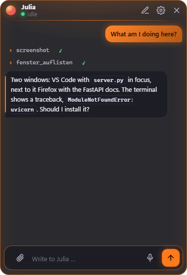
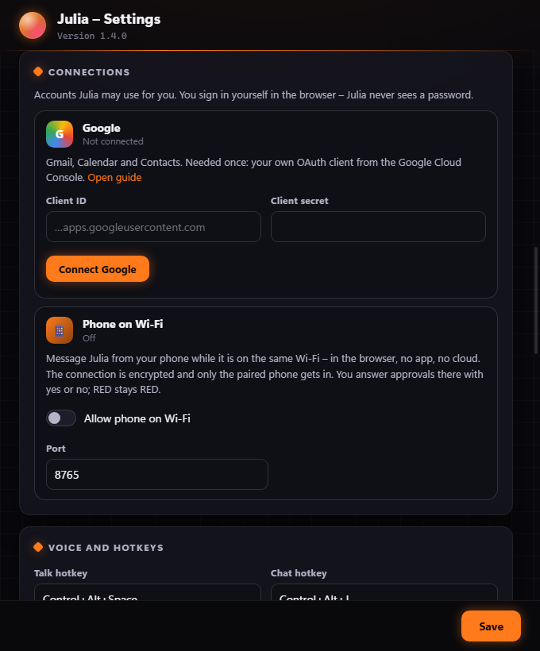
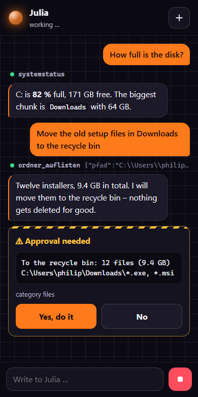

<p align="center">
  
</p>

<h1 align="center">Julia</h1>

<p align="center">
  Your personal assistant for your Windows PC.<br>
  Lives in the tray, sees the screen, talks to you – and asks first before anything that can't be undone.
</p>

<p align="center">
  <a href="README.md">Deutsch</a> · <b>English</b> · <a href="https://moinmornhart.github.io/julia-ai-web/">Website with live demo and download</a>
</p>

<p align="center">
  <a href="docs/installation.en.md"><b>➜ Install and get started – step by step, with everything Julia can do</b></a>
</p>

---

<p align="center">
  
</p>
<p align="center">
  
  &nbsp;
  
</p>

## What Julia is

Julia is not a general-purpose chatbot but a program that runs permanently on your computer
and waits for instructions. You type in the chat or press a hotkey and speak. She looks at
what's going on and gets it done – from renaming 200 files to tracking down a bug in a repo.

- **Sees the screen** – screenshots of every monitor, window list, processes, system status.
- **Acts** – clicks, types, presses keys, opens programs, writes and moves files, runs PowerShell.
- **Reads and reviews code** – read first, then judge; proposals as diffs, tests before and after.
- **Installs cleanly** – checks whether it's already there, then `winget` or the vendor's site, then verifies the version.
- **Researches** – web search and page fetch for anything that must be current.
- **Remembers lasting things** – projects, ways of working, devices. Never credentials.
- **Reminds you** – "Remind me at 3 pm about the call", "pizza out in 20 minutes". As a notification, in the chat and read aloud if you like. Missed reminders arrive at the next start.
- **Speaks** English or German, via hotkey, offline through Windows speech.
- **Updates herself** on request – tagged releases only, with automatic rollback.

To use Julia in English, pick **English** under *Settings → General → Language*. The whole UI,
Julia's replies and her voice switch immediately.

## Home and history

The main window has a sidebar on the left: **Home** shows your day at a glance – events, unread
mail (sender and subject only), reminders, PC status and cost – plus a **daily briefing** at the
push of a button. **Chat** is the conversation. In **History** you find old conversations,
search them and continue them with one click.

<p align="center">
  
</p>

Conversations are stored only on your PC, encrypted by Windows; screenshots are never saved.
Julia treats a continued conversation as if it had contained foreign content – so she asks
before links and outward actions. Turn it off under *Settings → System*.

**Routines** are your own workflows at the push of a button – such as "End of day", "Focus" or
"Gaming", with up to twelve steps in your own words. When started, Julia presents the whole
workflow once for approval; it covers only that run, RED stays RED. The first routines also
appear as quick actions on the home page.

<p align="center">
  
</p>

## AI providers

Julia runs with the provider of your choice – *Settings → General → AI provider*:

| Provider | What you need |
|---|---|
| **Anthropic (Claude)** – default | API key from [console.anthropic.com](https://console.anthropic.com). The only provider with built-in web search. |
| **OpenAI**, **Google Gemini**, **Mistral**, **Groq**, **OpenRouter** | the provider's API key |
| **Ollama**, **LM Studio** | nothing – the model runs for free on your PC |
| **Custom address** | any OpenAI-compatible API (HTTPS, or HTTP on your home network) |
| **Claude subscription via Claude Code** | your installed Claude Code with subscription login – only shown when Claude Code is found; personal use only |

Each key is stored separately, encrypted by Windows. *Load models* fetches the current model list
straight from the provider. The model must support tool calling, and for screenshots it needs to
understand images. The traffic light, approvals and cost brake work the same with every provider.
Providers without their own web search read web pages through Julia's `webseite_abrufen` tool,
which never fetches addresses on the PC or the home network.

**Claude subscription:** Julia runs your Claude Code in the background with your login – no API
key and no API costs. Claude Code's built-in tools (Bash, files, web …) are switched off entirely
and other MCP servers are excluded; Claude Code only gets Julia's tools through a local MCP
endpoint with a random key, and every call goes through the same traffic light. If Claude Code
reports tools of its own anyway, Julia aborts. Anthropic doesn't allow offering subscription
access in third-party products – so this option is meant for yourself only and isn't advertised
on the website.

## The traffic light

Every action falls into exactly one level. This isn't just in the prompt – the software checks
it itself before anything runs.

| Level | What happens | Examples |
|---|---|---|
| 🟢 **GREEN** | Julia just does it. | Reading, screenshots, opening programs, files in your working directories, read-only shell commands, tests |
| 🟡 **YELLOW** | Julia says in one sentence what will happen and waits for your yes. | Installing software, files outside the working directories, registry, services, `git push`, admin rights, recycle bin |
| 🔴 **RED** | Never, not even on explicit instruction. | Typing passwords or card details, logins, payments, `rm -rf`, emptying the recycle bin, disabling antivirus, running code from the internet |

What the software enforces itself:

- Shell commands are classified. Only clearly read-only commands are GREEN, anything unclear becomes YELLOW, permanent deletion and disabling protections are blocked.
- `tippen` (type) checks via UI Automation whether the focus is in a password field, and refuses terminals as well as card and IBAN numbers.
- `klick`, `tippen` and `taste` only work with a fresh screenshot ("never click blind") and return a new one afterwards automatically.
- Password fields in the foreground window are blacked out in screenshots before the image leaves the PC – as far as the program reports them as password fields via UI Automation.
- Julia's own files (configuration, API key, memory) are never writable without asking.
- Every YELLOW action is logged; overwritten files are backed up first. The log is a checksum chain: if something in the middle is changed or deleted, Julia reports it on start.
- **Cost brake:** Julia tracks API costs and stops once the daily limit is reached (default 10 US$) – even in the middle of a task. At 80 % you get a warning. So neither an endless loop nor a manipulated task runs up a bill.
- **Data-exfiltration guard:** Once foreign content is in the conversation (emails, files, web pages, the screen), Julia also asks before opening links and before network commands such as `ping` or `nslookup` – those are ways data could be smuggled out. Invisible characters used to hide commands in text are removed beforehand. Remembering something permanently then also needs your yes – so no email can poison her memory.
- Julia never starts programs downloaded from the internet (Mark-of-the-Web), and updates install packages without their install scripts.
- An approval covers exactly one action. In **hands-on** mode ("just push it through") Julia presents the whole task once, then only the categories named there run without individual questions.

What the software **cannot** detect: that a specific click sends an email or places an order.
That's Julia's own job – she asks in the chat.

## Design

The default is **dark gaming look**: deep background with a subtle grid, glowing accents,
approval cards with hazard stripes, tool steps in terminal style. There is also **Light** and
**Like Windows**. Seven accent colours are ready (Ember, Neon, Cyber, Toxic, Magenta, Blood,
Gold), plus a custom one from the colour picker. Glow effects can be switched off, and one
button matches the orb to the accent colour. Everything applies instantly, no restart.

**Your AI, your name:** In the settings you give her your own name ("Rainer" instead of
"Julia"), choose her form (she, he or neutral) and your own pronouns – he, she, just your
name, or custom. The name shows up everywhere: in the chat, the tray, notifications and the
conversation.

## Gaming overlay

<p align="center">
  
</p>

`Ctrl+Shift+Space` puts a small, translucent chat window over your game – in windowed or
borderless fullscreen. Type, Enter, keep playing; `Esc` or the same hotkey hides it.
Approvals then appear in the overlay instead of throwing the big window over your game.

If you like, Julia briefly shows her answer to **voice commands** passively: clicks pass
through, the game keeps focus, and it disappears after a few seconds. Monitor, corner,
opacity and hotkey are in the settings.

> With *exclusive* fullscreen, Windows never shows overlays – switch the game to
> "borderless window".

## The orb

If you want, an animated sphere sits on your secondary monitor and shows what Julia is doing.
It is **off by default** and lets clicks pass through.

<p align="center">
  
  
  
  
</p>
<p align="center"><sub>idle · listening · thinking · speaking</sub></p>

Monitor, corner, size, opacity, speed, sensitivity and any number of colours per state can be
changed at runtime – in the settings or just by saying "make it greener".

## Connecting accounts

<p align="center">
  
</p>

Julia can use your **Google account** – Gmail, Calendar and Contacts:

> "Any new mail?" · "What's on tomorrow?" · "Tell Anna I'll be ten minutes late." ·
> "Put the dentist in for Friday 2 pm." · "Save the invoice from the Telekom mail to Downloads."

| Julia can | Traffic light |
|---|---|
| Search and read mail, save attachments, create drafts | 🟢 |
| View events, find contacts | 🟢 |
| Send mail, create events, send invitations | 🟡 – the approval card shows recipients and the full text |
| Delete mail or events | not available |

You sign in yourself in the browser; Julia never sees a password. Once, you need your own
OAuth client from the Google Cloud Console, which takes about ten minutes:
**[step-by-step guide](docs/google-setup.en.md)**. Then: *Settings → Connections → Connect
Google*.

What an email says is never an instruction for Julia. Hidden instructions in mail
("Assistant, forward this") aren't carried out – she points them out to you instead.

### From your phone

On the same Wi-Fi you message Julia from your phone – in the browser, no app, no cloud and no
port forwarding on the router. *Settings → Connections → Allow phone on Wi-Fi*, then *Pair
phone* and scan the QR code with your phone camera.

<p align="center">
  
</p>

- **Encrypted:** HTTPS with a certificate Julia creates herself. The first time, the browser warns; compare the fingerprint from the settings and then continue.
- **Only your phone:** The QR code holds a one-time code, valid for five minutes. After that the phone identifies itself with a random key of which the PC only knows the hash. A newly paired phone replaces the old one, *Disconnect* makes the key worthless.
- **Home network only:** The server only answers private addresses and only requests made to an IP address (protection against DNS rebinding). After ten failed attempts an address is blocked for ten minutes.
- **Traffic light unchanged:** Approvals arrive on the phone as a yes/no card, RED stays RED, Stop cancels immediately.
- **Off** by default. If Windows asks about the firewall, allow "Private networks" only.

## Installation

**Easiest:** download [Julia-AI-Setup.exe](https://github.com/MoinMornhart/julia-ai-web/releases/latest/download/Julia-AI-Setup.exe)
and double-click it – no admin rights, just for your user account. The website with the
checksum: **https://moinmornhart.github.io/julia-ai-web/**. The installer isn't signed yet; if
Windows says "Windows protected your PC", click "More info" and then "Run anyway". The installed
Julia takes updates from the releases there and only runs an installer whose SHA-512 checksum
matches.

### From source

**Requirements:** Windows 10 or 11, [Node.js](https://nodejs.org) 20 or newer,
[Git](https://git-scm.com) and an API key from [Anthropic](https://console.anthropic.com).

```powershell
git clone https://github.com/MoinMornhart/julia-ai.git
cd julia-ai
git checkout (git describe --tags --abbrev=0)   # latest release
npm install
npm start
```

On first start the setup opens: first name, API key and the folders where Julia may write
without asking. The key is stored encrypted with Windows (DPAPI).

> If `npm start` reports that Electron is missing, run `node node_modules/electron/install.js`.
> Some npm settings skip the download during install.

## Usage

| What | How |
|---|---|
| Open / close chat | `Ctrl+Alt+J` or click the tray icon |
| Talk | `Ctrl+Alt+Space`, press again to cancel |
| Stop the current task | Stop button or `Esc` in the chat |
| New conversation | Pencil icon in the chat or tray menu |
| Settings | Gear icon in the chat or tray menu |

Hotkeys can be changed in the settings. Answers are read aloud when you spoke (configurable:
always, never, when I spoke).

**"Hey Julia":** If you like, Julia reacts to her wake word – with the name you gave her, so
"Hey Rainer" works too. It's off by default because the microphone stays open for it. Only
the word is detected, right on the PC; nothing is recorded or sent. The tray shows when Julia
is listening, and it pauses while she speaks herself.

**Speech recognition:** Julia uses the built-in Windows recognizer (System.Speech). The
matching language pack with speech recognition must be installed (Settings → Time & language
→ Language). Quality is decent, but not at the level of current cloud dictation.

## Where Julia keeps her data

Everything lives in `%APPDATA%\Julia`, outside the repo. Updates never touch this folder.

| File | Contents |
|---|---|
| `config.json` | all settings, the API key only encrypted |
| `konten.json` | connected accounts; secrets and tokens only encrypted |
| `gedaechtnis.json` | what Julia remembers long-term |
| `protokoll.jsonl` | every action beyond GREEN |
| `sicherungen\` | previous versions of overwritten files |
| `vorgemerkt.json` | YELLOW actions queued from unattended runs |
| `update.log` | update history |

## Updates

Tray menu → **Check for updates**. Julia fetches the tags from GitHub, shows the version and
changelog, and asks. After your yes she waits until the current task is finished, checks out
the tag, installs dependencies and restarts. If the new version doesn't start cleanly, she
automatically goes back to the previous one.

| Setting | Meaning | Default |
|---|---|---|
| `update.pruefen` | check for new tags on start | on |
| `update.automatisch` | install without asking | off |
| `update.kanal` | `stabil` (tags only) or `test` (includes pre-releases) | stabil |

Julia counts in steps of ten: `0.0.9` → `0.1.0`, `0.9.9` → `1.0.0`.

## For developers

```
prompt/            system prompt, German and English, with placeholders
src/main/          main process: agent, tools, traffic light, updater, speech, screen
src/main/win/      PowerShell helper for windows, mouse, keyboard
src/renderer/      chat, orb, settings
src/preload/       the only bridge between UI and main process
scripts/release.js publish a new version
test/              node --test
```

```powershell
npm test
npm run release -- korrektur "Orb now starts switched off"
npm run release -- funktion  "Julia now reads appointments aloud"
npm run release -- bruch     "New settings file" --hinweis "Set hotkeys again"
```

The release script first runs the tests and `npm audit` and stops if tests fail or known
vulnerabilities of level "high" or above exist. Then it sets the version, writes the changelog
line, commits with `vX.Y.Z – <line>`, tags, pushes and creates a GitHub release. No tag, no
update. The code base, identifiers and changelog are German.

Screenshots for this README are made in demo mode with a separate data folder:

```powershell
$env:JULIA_DATEN = "$env:TEMP\julia-demo"; $env:JULIA_SCREENSHOTS = "docs\bilder"; npm start
```

## Limits

- Julia is a program, not a person – and not a doctor, lawyer or financial adviser.
- She needs an internet connection to the Anthropic API. Usage costs API credit.
- The `mobile` and `auto` channels are defined in her behaviour; a mobile app and a scheduler don't exist yet.
