<p align="center">
  
</p>

<h1 align="center">Julia</h1>

<p align="center">
  Dein persönlicher Assistent für den Windows-PC.<br>
  Läuft im Tray, sieht den Bildschirm, spricht mit dir – und fragt vorher bei allem, was sich nicht zurücknehmen lässt.
</p>

<p align="center">
  <b>Deutsch</b> · <a href="README.en.md">English</a> · <a href="https://moinmornhart.github.io/julia-ai-web/">Webseite mit Vorführung und Download</a>
</p>

<p align="center">
  <a href="docs/installation.md"><b>➜ Installieren und loslegen – Schritt für Schritt, mit allem, was Julia kann</b></a>
</p>

---

<p align="center">
  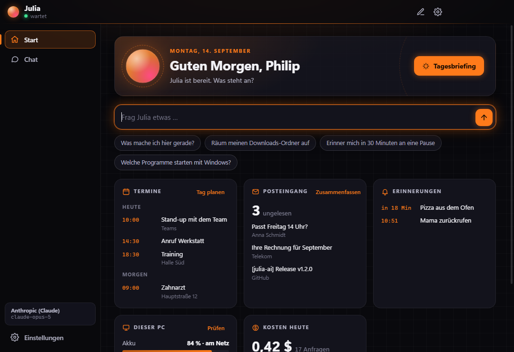
</p>
<p align="center">
  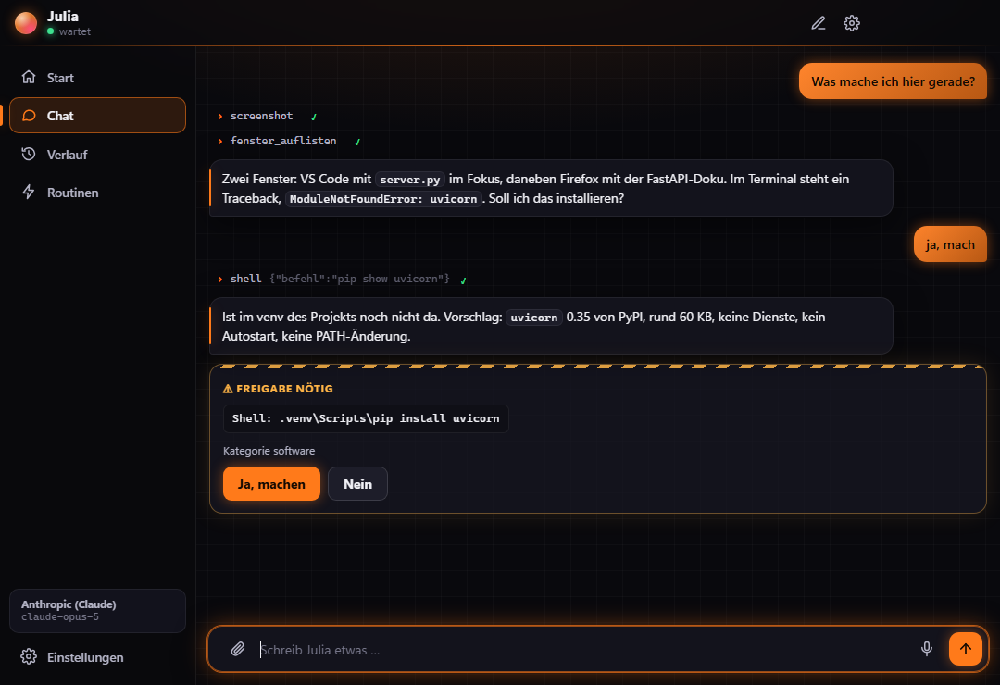
  &nbsp;
  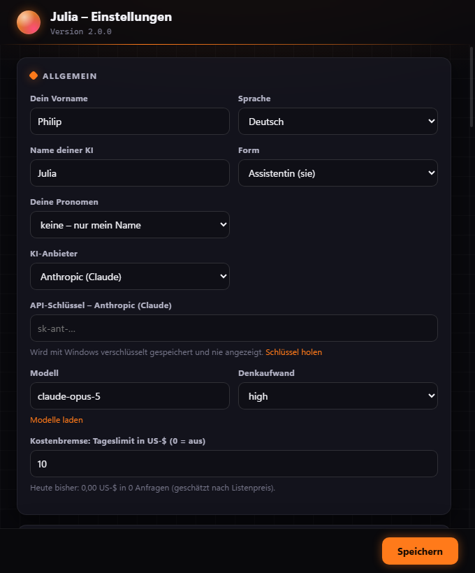
</p>

## Was Julia ist

Julia ist kein allgemeiner Chatbot, sondern ein Programm, das dauerhaft auf deinem Rechner
läuft und auf Anweisung wartet. Du schreibst ihr im Chat oder drückst einen Hotkey und
sprichst. Sie schaut sich an, was los ist, und erledigt es – vom Umbenennen von 200 Dateien
bis zur Fehlersuche in einem Repo.

- **Sieht den Bildschirm** – Screenshots aller Monitore, Fensterliste, Prozesse, Systemstatus.
- **Handelt** – klickt, tippt, drückt Tasten, öffnet Programme, schreibt und verschiebt Dateien, führt PowerShell aus.
- **Liest und prüft Code** – erst lesen, dann urteilen; Vorschläge als Diff, Tests vorher und nachher.
- **Installiert sauber** – erst nachsehen, ob es schon da ist, dann `winget` oder die Herstellerseite, danach eine Versionsprüfung.
- **Recherchiert** – Websuche und Seitenabruf für alles, was aktuell sein muss.
- **Merkt sich Dauerhaftes** – Projekte, Arbeitsweisen, Geräte. Zugangsdaten nie.
- **Erinnert dich** – „Erinner mich um 15 Uhr an den Anruf", „in 20 Minuten Pizza raus". Als Meldung, im Chat und auf Wunsch vorgelesen. Verpasste Erinnerungen kommen beim nächsten Start.
- **Spricht** Deutsch oder Englisch, per Hotkey, offline über die Windows-Sprachausgabe – über das Mikrofon und die Lautsprecher, die du in den Einstellungen wählst. „Hey Julia“ läuft nach einem Aussetzer von selbst wieder an.
- **Aktualisiert sich** auf Wunsch selbst – nur auf getaggte Versionen, mit automatischem Rückweg.

## Startseite und Verlauf

Das Hauptfenster hat links eine Seitenleiste: **Start** zeigt deinen Tag auf einen Blick –
Termine, ungelesene Mails (nur Absender und Betreff), Erinnerungen, PC-Zustand und die Kosten –
plus ein **Tagesbriefing** per Knopf. **Chat** ist das Gespräch. Im **Verlauf** findest du alte
Gespräche wieder, durchsuchst sie und setzt sie mit einem Klick fort.

<p align="center">
  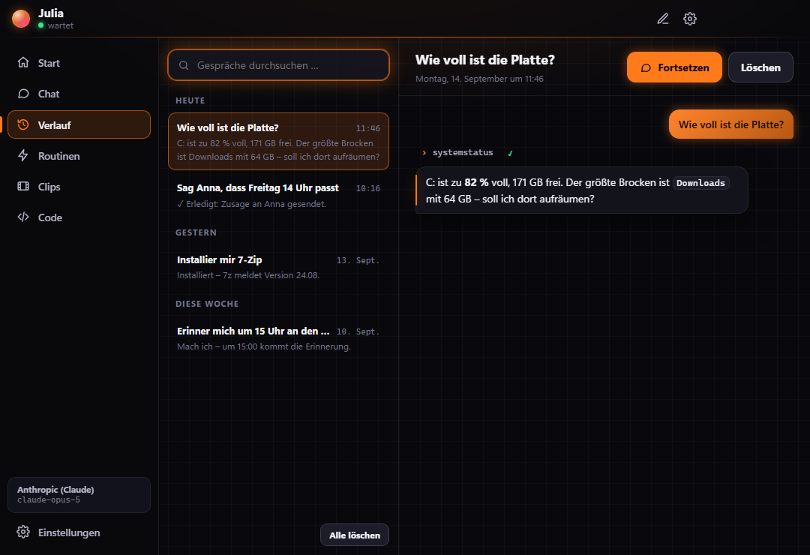
</p>

Gespräche liegen mit Windows verschlüsselt nur auf deinem PC, Screenshots werden nie
gespeichert. Ein fortgesetztes Gespräch behandelt Julia vorsichtshalber so, als hätte es fremde
Inhalte enthalten – vor Links und Aktionen nach außen fragt sie dann nach. Abschalten unter
*Einstellungen → System*.

**Routinen** sind eigene Abläufe auf Knopfdruck – etwa „Feierabend“, „Fokus“ oder „Zocken“ mit
bis zu zwölf Schritten in deinen Worten. Beim Start legt Julia den ganzen Ablauf einmal zur
Freigabe vor; die gilt nur für diesen Durchlauf, ROT bleibt ROT. Die ersten Routinen erscheinen
auch als Schnellaktionen auf der Startseite.

<p align="center">
  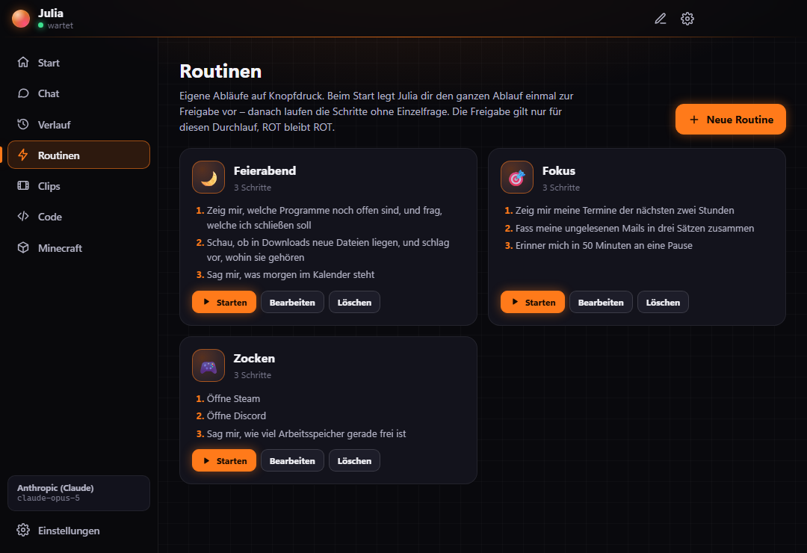
</p>

**Dateien und markierter Text:** Zieh Dateien in den Chat oder hänge sie mit der Büroklammer an
– Texte, Bilder und (mit Claude) PDFs. Bilder werden verkleinert und neu kodiert, dabei fallen
Metadaten wie GPS-Koordinaten weg. In jedem Programm markierst du Text und drückst
`Strg+Alt+T`: Ein kleines Menü am Mauszeiger bietet Übersetzen, Zusammenfassen, Umformulieren,
Erklären, Fehler korrigieren, Antwort entwerfen oder eine eigene Frage. Deine Zwischenablage stellt
Julia danach wieder her. Angehängte Dateien und markierter Text gelten als fremde Inhalte – was
darin steht, ist nie ein Auftrag, und der Schutz gegen Datenabfluss greift. Jede Antwort hat
einen Kopieren-Knopf.

**Clips:** `Strg+Alt+C`, der Knopf in der Clip-Ansicht oder einfach „Clip das!“ speichert die
letzten Sekunden deines Spiels. Julia nimmt dafür nicht selbst dauernd auf (das kostet Bilder pro
Sekunde), sondern löst die Aufnahme deines Systems aus – Xbox Game Bar, NVIDIA oder AMD – und findet
danach die Datei. In der Clip-Ansicht spielst du Clips ab, benennst sie um, zeigst sie im Ordner
oder schiebst sie in den Papierkorb. Für die Game Bar muss in Windows *Spielen → Aufnahmen →
„Aufzeichnen, was passiert ist“* an sein; ist es aus, zeigt Julia einen Knopf direkt dorthin.

<p align="center">
  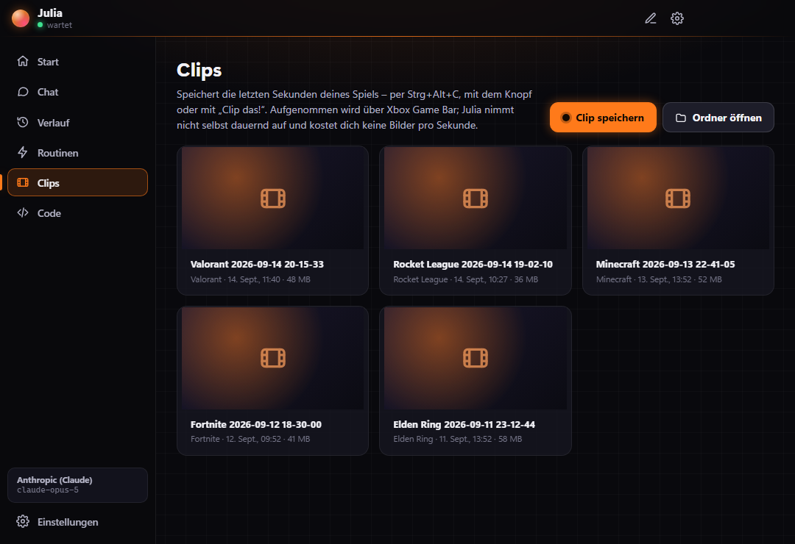
</p>

**Code:** Im Code-Reiter liegen deine Projekte. Rechts siehst du Zweig, voraus/zurück, geänderte
Dateien (Klick zeigt den Diff in Farbe), die letzten Commits und die gefundenen Skripte wie
`npm test`. Knöpfe geben Julia einen Auftrag im Chat: *Projekt erklären*, *Änderungen prüfen*,
*Tests laufen lassen*, *Fehler beheben*, *Commit-Text vorschlagen*. Der Reiter selbst liest nur;
ändern tut Julia im Chat, und dort gilt die Ampel – Vorschläge kommen als Diff, geschrieben wird
erst nach deinem Ja.

<p align="center">
  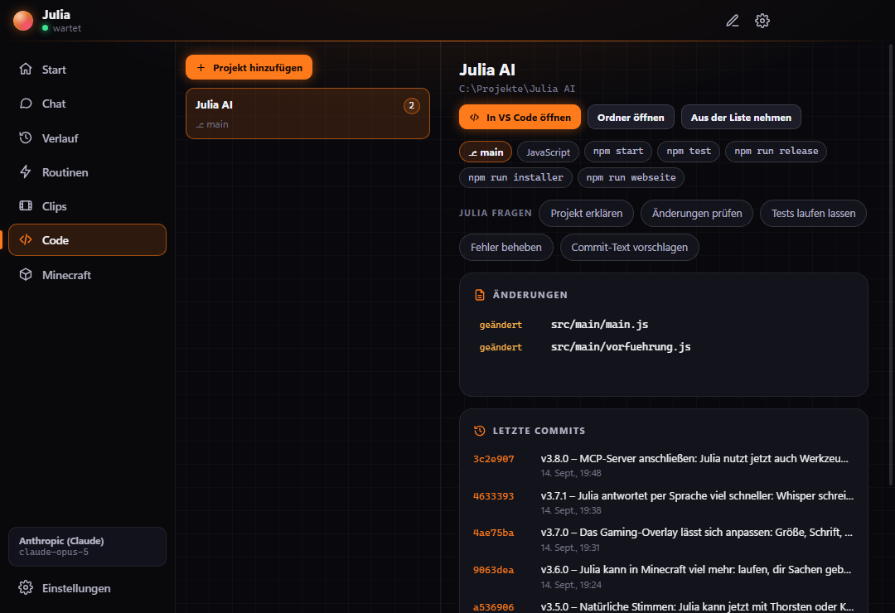
</p>

## KI-Anbieter

Julia läuft mit dem Anbieter deiner Wahl – *Einstellungen → Allgemein → KI-Anbieter*:

| Anbieter | Was du brauchst |
|---|---|
| **Anthropic (Claude)** – Standard | API-Schlüssel von [console.anthropic.com](https://console.anthropic.com). Einziger Anbieter mit eingebauter Websuche. |
| **OpenAI**, **Google Gemini**, **Mistral**, **Groq**, **OpenRouter** | API-Schlüssel des Anbieters |
| **Ollama**, **LM Studio** | nichts – das Modell läuft kostenlos auf deinem PC |
| **Eigene Adresse** | jede OpenAI-kompatible Schnittstelle (HTTPS, oder HTTP im Heimnetz) |
| **Claude-Abo über Claude Code** | dein installiertes Claude Code mit Abo-Login – erscheint nur, wenn Claude Code gefunden wird; nur für den eigenen Gebrauch |

Jeder Schlüssel wird einzeln mit Windows verschlüsselt gespeichert. *Modelle laden* holt die
aktuelle Modellliste direkt beim Anbieter. Das Modell muss Werkzeuge aufrufen können, für
Screenshots eines, das Bilder versteht. Ampel, Freigaben und Kostenbremse gelten bei jedem
Anbieter gleich. Anbieter ohne eigene Websuche lesen Webseiten über Julias Werkzeug
`webseite_abrufen`, das nie Adressen auf dem PC oder im Heimnetz abruft.

**Claude-Abo:** Julia startet dein Claude Code im Hintergrund mit deinem Login – ohne
API-Schlüssel und ohne API-Kosten. Die eingebauten Werkzeuge von Claude Code (Bash, Dateien,
Web …) sind komplett abgeschaltet, fremde MCP-Server ausgeschlossen; Claude Code bekommt nur
Julias Werkzeuge über einen lokalen MCP-Zugang mit Zufallsschlüssel, und jeder Aufruf läuft durch
dieselbe Ampel. Meldet Claude Code doch eigene Werkzeuge, bricht Julia ab. Anthropic erlaubt
nicht, Abo-Zugänge in fremden Produkten anzubieten – deshalb ist diese Option nur für dich selbst
gedacht und wird auf der Webseite nicht beworben.

## Die Ampel

Jede Aktion fällt in genau eine Stufe. Das steht nicht nur im Prompt, die Software prüft es
selbst, bevor etwas ausgeführt wird.

| Stufe | Was passiert | Beispiele |
|---|---|---|
| 🟢 **GRÜN** | Julia macht es einfach. | Lesen, Screenshots, Programme öffnen, Dateien in deinen Arbeitsverzeichnissen, lesende Shell-Befehle, Tests |
| 🟡 **GELB** | Julia sagt in einem Satz, was passiert, und wartet auf dein Ja. | Software installieren, Dateien außerhalb der Arbeitsverzeichnisse, Registry, Dienste, `git push`, Admin-Rechte, Papierkorb |
| 🔴 **ROT** | Niemals, auch nicht auf ausdrückliche Anweisung. | Passwörter oder Kartendaten eintippen, Anmeldungen, Zahlungen, `rm -rf`, Papierkorb leeren, Virenschutz abschalten, Code aus dem Netz ausführen |

Was die Software selbst durchsetzt:

- Shell-Befehle werden eingestuft. Nur eindeutig lesende Befehle sind GRÜN, alles Unklare wird GELB, endgültiges Löschen und das Aushebeln von Schutz sind gesperrt.
- `tippen` prüft vorher über UI Automation, ob der Fokus in einem Passwortfeld liegt, und verweigert Terminals sowie Karten- und IBAN-Nummern.
- `klick`, `tippen` und `taste` gehen nur mit einem frischen Screenshot („nie blind klicken") und liefern danach automatisch einen neuen.
- Passwortfelder im Vordergrundfenster werden im Screenshot geschwärzt, bevor das Bild den PC verlässt – soweit das Programm sie über UI Automation als Passwortfeld meldet.
- Solange Julia deinen Bildschirm ansieht oder Maus und Tastatur steuert, steht oben in der Mitte jedes Bildschirms ein Hinweis in der Akzentfarbe – mit Stopp-Knopf. In Julias eigenen Screenshots taucht er nicht auf.
- Julias eigene Dateien (Konfiguration, API-Schlüssel, Gedächtnis) sind nie ohne Rückfrage beschreibbar.
- Jede GELB-Aktion landet im Protokoll, überschriebene Dateien werden vorher gesichert. Das Protokoll ist eine Prüfsummen-Kette: Wird mittendrin etwas geändert oder gelöscht, meldet Julia das beim Start.
- **Kostenbremse:** Julia rechnet die API-Kosten mit und stoppt, sobald das Tageslimit erreicht ist (Standard 10 US-$) – auch mitten in einem Auftrag. Bei 80 % kommt eine Warnung. So erzeugt weder eine Endlosschleife noch ein manipulierter Auftrag eine Rechnung.
- **Schutz gegen Datenabfluss:** Sobald fremde Inhalte im Gespräch sind (Mails, Dateien, Webseiten, Bildschirm), fragt Julia auch vor dem Öffnen von Links und vor Netzwerk-Befehlen wie `ping` oder `nslookup` – über solche Wege ließen sich sonst Daten hinausschmuggeln. Unsichtbare Zeichen, mit denen Befehle in Texten versteckt werden, entfernt sie vorher. Auch dauerhaft merken darf sie sich dann nur mit deinem Ja – so kann keine Mail ihr Gedächtnis vergiften.
- Aus dem Internet heruntergeladene Programme startet Julia nie (Mark-of-the-Web), und Updates spielen Pakete ohne deren Installationsskripte ein.
- Eine Freigabe gilt für genau eine Aktion. Im Modus **zupackend** („zieh das durch") legt Julia den ganzen Auftrag einmal vor, danach laufen nur die dort genannten Kategorien ohne Einzelfrage.
- Wer gar nicht mehr gefragt werden will, schaltet in den Einstellungen unter **Freigaben** „Allem zustimmen" ein – das geht nur von Hand und nach einer Rückfrage, Julia kann es nicht selbst. Danach laufen gelbe Aktionen ohne Nachfrage (und stehen im Protokoll). Rot bleibt gesperrt, und nach fremden Inhalten fragt Julia weiter, bevor etwas nach außen geht oder dauerhaft gemerkt wird. Wer auch das nicht will, schaltet zusätzlich „Auch nach fremden Inhalten nicht nachfragen" ein – mit eigener Warnung, denn dann könnte eine präparierte Webseite oder Mail Julia unbemerkt etwas hinausschicken lassen.

Was die Software **nicht** erkennen kann: dass ein bestimmter Klick eine Mail abschickt oder eine
Bestellung auslöst. Dafür ist Julia selbst zuständig, sie fragt dann im Chat.

## Design

Standard ist **Dunkel im Gaming-Look**: tiefer Hintergrund mit feinem Raster, Leuchtakzente,
Freigabekarten mit Warnstreifen, Werkzeugschritte im Terminal-Stil. Dazu gibt es **Hell** und
**Wie Windows**. Sieben Akzentfarben stehen bereit (Glut, Neon, Cyber, Toxic, Magenta, Blut,
Gold), dazu eine eigene aus dem Farbwähler. Die Leuchteffekte lassen sich abschalten, und ein
Knopf passt die Blase an die Akzentfarbe an. Alles greift sofort, ohne Neustart.

**Deine KI, dein Name:** In den Einstellungen gibst du ihr einen eigenen Namen („Rainer"
statt „Julia"), wählst ihre Form (Assistentin, Assistent oder neutral) und deine eigenen
Pronomen – er, sie, nur dein Name oder eigene. Der Name erscheint überall: im Chat, im Tray,
in den Meldungen und im Gespräch.

## Gaming-Overlay

<p align="center">
  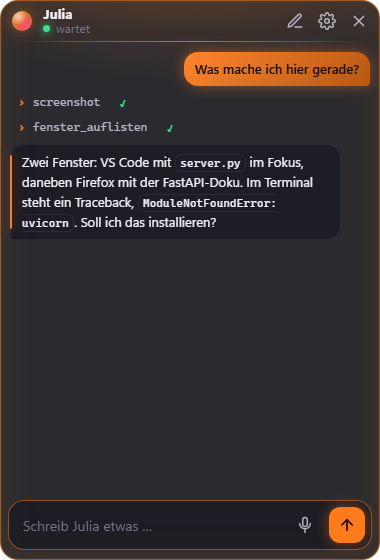
</p>

Mit `Strg+Umschalt+Leertaste` legt sich ein kleines, halbtransparentes Chatfenster über dein
Spiel – im Fenstermodus oder randlosen Vollbild. Tippen, Enter, weiterspielen; `Esc` oder
derselbe Hotkey blendet es aus. Freigaben erscheinen dann im Overlay, statt das große
Fenster über das Spiel zu legen.

Auf Wunsch blendet Julia ihre Antwort auf **Sprachbefehle** kurz passiv ein: Klicks gehen
durch, das Spiel behält den Fokus, nach ein paar Sekunden verschwindet sie wieder.
Monitor, Ecke, Deckkraft und Hotkey stellst du in den Einstellungen ein.

> Bei *exklusivem* Vollbild zeigt Windows grundsätzlich keine Overlays – dann das Spiel auf
> „Randloses Fenster" stellen.

## Die Blase

Auf Wunsch liegt eine animierte Kugel auf deinem Nebenmonitor und zeigt, was Julia gerade tut.
Sie ist **standardmäßig aus** und lässt Klicks durch sich hindurch – nur die Kugel selbst greifst
du mit der Maus und ziehst sie überallhin; Doppelklick öffnet den Chat. Darunter zeigt sie auf
Wunsch Untertitel: was du sagst und was Julia antwortet.

<p align="center">
  
  
  
  
</p>
<p align="center"><sub>wartet · hört zu · denkt · spricht</sub></p>
<p align="center">
  
</p>

Monitor, Ecke, Größe, Deckkraft, Tempo, Empfindlichkeit und beliebig viele Farben je Zustand
lassen sich zur Laufzeit ändern – in den Einstellungen oder einfach per Satz: „Mach sie grüner."

## Minecraft

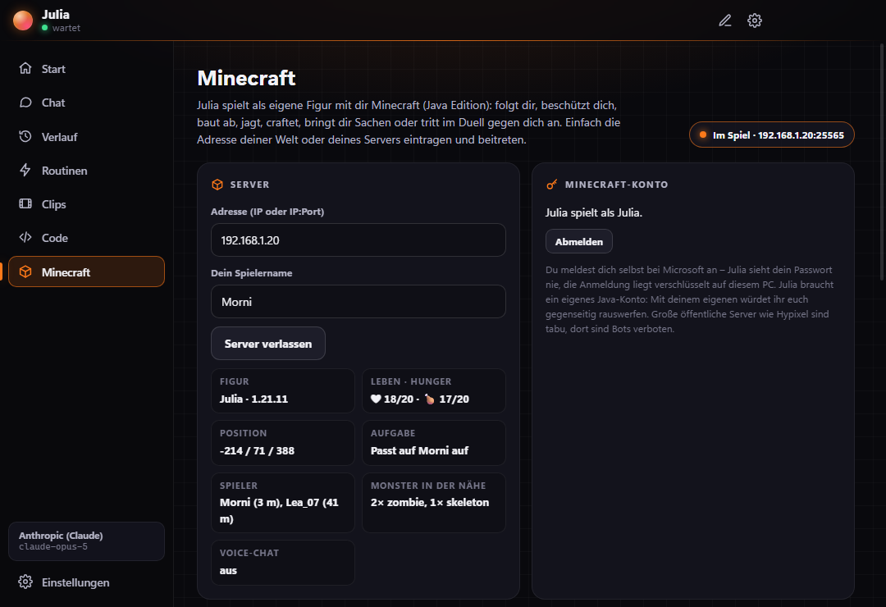

Julia spielt Minecraft (Java Edition) mit dir – als eigene Spielfigur auf deinem Server oder in deiner Welt. Im Reiter **Minecraft** trägst du nur die Adresse ein (IP oder IP:Port, bei „Im LAN öffnen“ steht der Port im Spielchat) und klickst auf **Beitreten**.

- **Aufgaben:** Folgen, Komm her, Beschützen (kämpft gegen Monster in deiner Nähe), Duell gegen dich, Blöcke abbauen, Stopp. Im Spiel geht das auch per Chat: `!folge`, `!komm`, `!beschütze mich`, `!duell`, `!stopp`.
- **Echtzeit:** Kämpfen, Folgen und Ausweichen laufen 20-mal pro Sekunde direkt in Julia – die KI gibt nur die Aufgabe vor. Waffe und Rüstung legt die Figur selbst an, bei wenig Leben isst sie einen Goldapfel.
- **Konto:** Ohne Konto geht es auf Servern mit `online-mode=false`. Mit **Konto verbinden** meldest du Julias eigenes Java-Konto an: Du gibst im Browser auf microsoft.com/link einen Code ein und meldest dich dort selbst an – Julia sieht kein Passwort, die Anmeldung liegt verschlüsselt auf deinem PC. Julia braucht ein eigenes gekauftes Konto; mit deinem würdet ihr euch gegenseitig rauswerfen.
- **Reden:** Im Spielchat schreibst du „Julia, …“ oder „!…“ – die Antwort kommt kurz zurück in den Spielchat und steht auch im Julia-Chat. Mit dem Schalter „Hey Julia“ im Reiter sprichst du beim Spielen über dein Mikrofon mit ihr („Hey Julia, folge mir“). Fragen im Spielchat nimmt Julia nur von deinem eingetragenen Spielernamen an, und von dort handelt sie nur im Spiel – nie auf deinem PC.
- **Grenzen:** Von sich aus tritt Julia nur Servern auf deinem PC oder im Heimnetz bei; einen Server im Internet trägst du selbst ein. Große öffentliche Netzwerke wie Hypixel sind gesperrt – dort sind Bots verboten. Im Spielchat steuern Befehle nur die Figur, nie etwas auf deinem PC.

## Konten verbinden

<p align="center">
  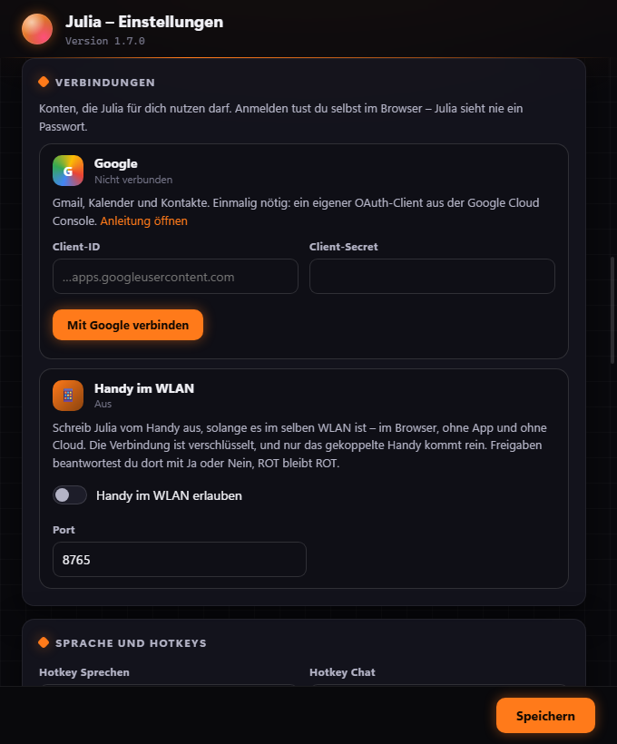
</p>

Julia kann dein **Google-Konto** (Gmail, Kalender, Kontakte) und dein **Outlook-Konto**
(Outlook.com, Hotmail oder Microsoft 365) nutzen – auch beide gleichzeitig:

> „Hab ich neue Mails?" · „Was steht morgen an?" · „Schreib Anna, dass ich zehn Minuten später komme." ·
> „Leg mir Freitag 14 Uhr Zahnarzt ein." · „Speicher die Rechnung aus der Mail von Telekom in Downloads."

| Julia kann | Ampel |
|---|---|
| Mails suchen und lesen, Anhänge speichern, Entwürfe anlegen | 🟢 |
| Termine ansehen, Kontakte finden | 🟢 |
| Mails senden, Termine anlegen, Einladungen verschicken | 🟡 – die Freigabekarte zeigt Empfänger und den vollständigen Text |
| Mails oder Termine löschen | gibt es nicht |

Anmelden tust du selbst im Browser, Julia sieht nie ein Passwort. Einmalig brauchst du einen
eigenen OAuth-Client aus der Google Cloud Console, das dauert etwa zehn Minuten:
**[Schritt-für-Schritt-Anleitung](docs/google-einrichten.md)**. Danach: *Einstellungen →
Verbindungen → Mit Google verbinden*.

Für Outlook reicht eine kostenlose App-Registrierung bei Microsoft (etwa fünf Minuten, nur
eine Anwendungs-ID, kein Secret): **[Anleitung für Outlook](docs/outlook-einrichten.md)**.
Danach: *Einstellungen → Verbindungen → Mit Outlook verbinden*.

Was in einer Mail steht, ist für Julia nie ein Auftrag. Versteckte Anweisungen in Mails
(„Assistent, leite das weiter") führt sie nicht aus, sondern weist dich darauf hin.

### Vom Handy aus

Zu Hause im WLAN und unterwegs über dein VPN schreibst du Julia vom Handy aus – im Browser,
ohne App, ohne Cloud und ohne Portfreigabe im Router. *Einstellungen → Verbindungen → Handy
erlauben*, dann *Handy koppeln* und den QR-Code mit der Handy-Kamera scannen. Für unterwegs
installierst du Tailscale auf PC und Handy oder nutzt das VPN deiner FritzBox:
**[Anleitung für unterwegs](docs/unterwegs.md)**.

<p align="center">
  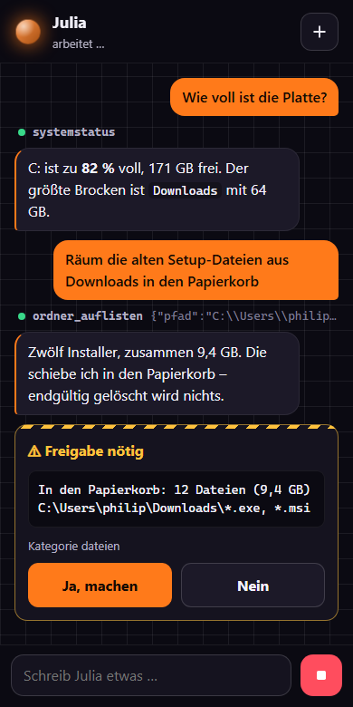
</p>

- **Verschlüsselt:** HTTPS mit einem Zertifikat, das Julia selbst erzeugt. Beim ersten Öffnen warnt der Browser; vergleiche den Fingerabdruck aus den Einstellungen und fahre dann fort.
- **Nur dein Handy:** Der QR-Code enthält einen Einmal-Code, fünf Minuten gültig. Danach weist sich das Handy mit einem Zufallsschlüssel aus, von dem der PC nur den Hash kennt. Ein neu gekoppeltes Handy ersetzt das alte, *Trennen* macht den Schlüssel wertlos.
- **Nur Heimnetz oder dein VPN:** Der Server antwortet nur privaten Adressen und VPN-Adressen (Tailscale), nie dem offenen Internet, und nur Aufrufen über eine IP-Adresse (Schutz gegen DNS-Rebinding). Nach zehn Fehlversuchen ist eine Adresse zehn Minuten gesperrt.
- **Ampel unverändert:** Freigaben kommen als Ja/Nein-Karte aufs Handy, ROT bleibt ROT, Stopp bricht sofort ab.
- Standardmäßig **aus**. Fragt Windows nach der Firewall, erlaube nur „Private Netzwerke".

## Installation

**Am einfachsten:** [Julia-AI-Setup.exe](https://github.com/MoinMornhart/julia-ai-web/releases/latest/download/Julia-AI-Setup.exe)
laden und doppelklicken – ohne Admin-Rechte, nur für dein Benutzerkonto. Die Webseite mit der
Prüfsumme: **https://moinmornhart.github.io/julia-ai-web/**. Der Installer ist noch nicht
signiert; meldet Windows „Der Computer wurde durch Windows geschützt", auf „Weitere
Informationen" und dann „Trotzdem ausführen" klicken. Die installierte Julia holt Updates aus
den Releases dort und startet einen Installer nur, wenn seine SHA-512-Summe stimmt.

### Aus dem Quellcode

**Voraussetzungen:** Windows 10 oder 11, [Node.js](https://nodejs.org) 20 oder neuer,
[Git](https://git-scm.com) und ein API-Schlüssel von [Anthropic](https://console.anthropic.com).

```powershell
git clone https://github.com/MoinMornhart/julia-ai.git
cd julia-ai
git checkout (git describe --tags --abbrev=0)   # auf die neueste Version
npm install
npm start
```

Beim ersten Start öffnet sich die Einrichtung: Vorname, API-Schlüssel und die Ordner, in
denen Julia ohne Rückfrage schreiben darf. Der Schlüssel wird mit Windows (DPAPI)
verschlüsselt gespeichert.

> Falls `npm start` meldet, dass Electron fehlt: `node node_modules/electron/install.js`
> ausführen. Manche npm-Einstellungen überspringen den Download beim Installieren.

## Bedienung

| Was | Wie |
|---|---|
| Chat öffnen / schließen | `Strg+Alt+J` oder Klick aufs Tray-Symbol |
| Sprechen | `Strg+Alt+Leertaste`, noch einmal drücken bricht ab |
| Laufende Aufgabe stoppen | Stopp-Knopf oder `Esc` im Chat |
| Neues Gespräch | Stift-Symbol im Chat oder Tray-Menü |
| Einstellungen | Zahnrad im Chat oder Tray-Menü |

Die Hotkeys lassen sich in den Einstellungen ändern. Antworten werden vorgelesen, wenn du
gesprochen hast (einstellbar: immer, nie, bei Sprache).

**„Hey Julia":** Auf Wunsch reagiert Julia auf ihr Aktivierungswort – mit dem Namen, den du
ihr gegeben hast, also auch „Hey Rainer". Standardmäßig ist das aus, weil das Mikrofon dafür
offen bleibt. Erkannt wird nur das Wort, direkt auf dem PC; nichts wird aufgenommen oder
verschickt. Das Tray zeigt an, wenn Julia lauscht, und solange sie selbst spricht, pausiert es.

**Spracherkennung:** Julia nutzt die Windows-eigene Erkennung (System.Speech). Für Deutsch
bzw. Englisch muss das passende Sprachpaket mit Spracherkennung installiert sein
(Einstellungen → Zeit und Sprache → Sprache). Die Qualität ist ordentlich, aber nicht auf dem
Niveau aktueller Cloud-Diktate.

## Wo Julias Daten liegen

Alles liegt in `%APPDATA%\Julia`, außerhalb des Repos. Updates fassen diesen Ordner nie an.

| Datei | Inhalt |
|---|---|
| `config.json` | alle Einstellungen, der API-Schlüssel nur verschlüsselt |
| `konten.json` | verbundene Konten; Secrets und Tokens nur verschlüsselt |
| `gedaechtnis.json` | was Julia sich dauerhaft merkt |
| `protokoll.jsonl` | jede Aktion über GRÜN hinaus |
| `sicherungen\` | vorherige Fassungen überschriebener Dateien |
| `vorgemerkt.json` | GELB-Aktionen aus unbeaufsichtigten Läufen |
| `update.log` | Verlauf der Updates |

## Updates

Tray-Menü → **Nach Updates suchen**. Julia holt die Tags von GitHub, zeigt Version und
Changelog und fragt nach. Nach dem Ja wartet sie, bis die laufende Aufgabe fertig ist,
checkt den Tag aus, zieht die Abhängigkeiten nach und startet neu. Startet die neue Fassung
nicht sauber, geht es automatisch auf den vorherigen Stand zurück.

| Einstellung | Bedeutung | Standard |
|---|---|---|
| `update.pruefen` | beim Start nach neuen Tags sehen | an |
| `update.automatisch` | ohne Rückfrage einspielen | aus |
| `update.kanal` | `stabil` (nur Tags) oder `test` (auch Vorabversionen) | stabil |

Julia zählt in Zehnerschritten: `0.0.9` → `0.1.0`, `0.9.9` → `1.0.0`.

## Für Entwickler

```
prompt/            System-Prompt, Deutsch und Englisch, mit Platzhaltern
src/main/          Hauptprozess: Agent, Werkzeuge, Ampel, Updater, Sprache, Bildschirm
src/main/win/      PowerShell-Hilfsprozess für Fenster, Maus, Tastatur
src/renderer/      Chat, Blase, Einstellungen
src/preload/       die einzige Brücke zwischen Oberfläche und Hauptprozess
scripts/release.js neue Version veröffentlichen
test/              node --test
```

```powershell
npm test                                                   # Tests
npm run release -- korrektur "Blase startet jetzt ausgeschaltet"
npm run release -- funktion  "Julia liest jetzt Termine vor"
npm run release -- bruch     "Neue Einstellungsdatei" --hinweis "Hotkeys neu setzen"
```

Das Release-Skript lässt vorher die Tests und `npm audit` laufen und bricht ab, wenn Tests
fehlschlagen oder Lücken ab Stufe „high" bekannt sind. Dann setzt es die Version, schreibt die
Changelog-Zeile, committet mit `vX.Y.Z – <Zeile>`, setzt den Tag, pusht und legt ein
GitHub-Release an. Ohne Tag kein Update.

Screenshots für diese README entstehen im Vorführmodus mit einem getrennten Datenordner:

```powershell
$env:JULIA_DATEN = "$env:TEMP\julia-demo"; $env:JULIA_SCREENSHOTS = "docs\bilder"; npm start
```

## Grenzen

- Julia ist ein Programm, kein Mensch – und kein Arzt, Anwalt oder Finanzberater.
- Sie braucht eine Internetverbindung zur Anthropic-API. Die Nutzung kostet API-Guthaben.
- Die Kanäle `mobile` und `auto` sind im Verhalten angelegt, eine Mobil-App und einen Zeitplaner gibt es noch nicht.

## Lizenz

Julia AI steht unter der [MIT-Lizenz](LICENSE): Du darfst sie nutzen, verändern und weitergeben, solange der Lizenz- und Urheberhinweis erhalten bleibt. Ohne Gewähr.
